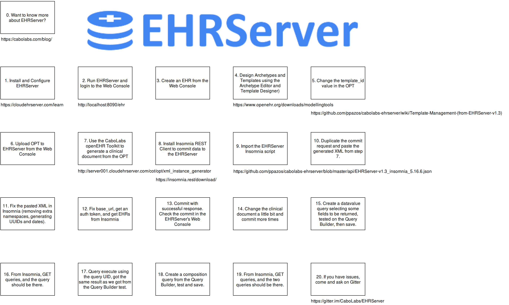

# EHRServer Flow Demo

Most developers, new to the openEHR specifications and methodology, find a painful path from having the need of using an openEHR CDR to actually using one effectively to store and retrieve openEHR data. Considering this, I have created a step by step guide as a video, that includes every single step a developer should follow to be able to define, commit and query clinical data from the EHRServer, the first openEHR-cimpliant open source CDR.

We tried to make this as simple and developer friendly as possible, even if you don't know much about the openEHR standard, you can still use it and say "my app is openEHR compliant".

## Watch the demo here:

## Full flow:

